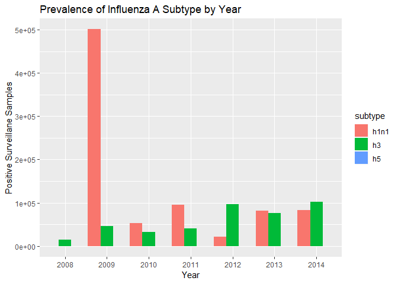
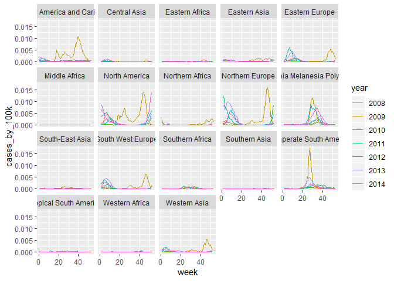
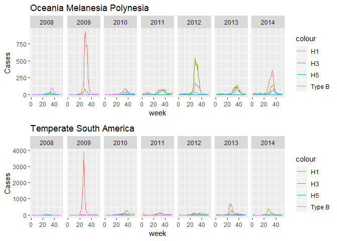
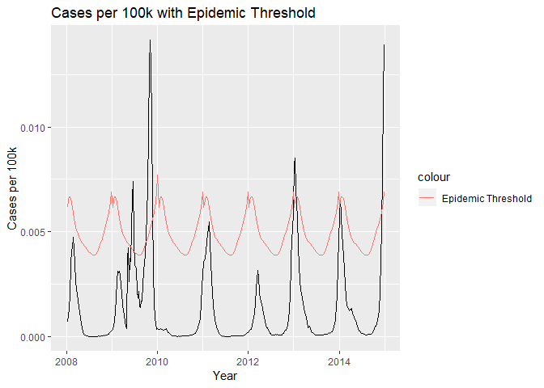

Report
================

This is our Key Findings from our Final Report.

The Github Repo for this report can be found [here](https://github.com/mattperrotta/final_project)

### Motivation

The primary objective of this project and endeavour is to explore the tools necessary to work in the intersection of infectious disease epidemiology modeling and data science. In fact, the four team members are a part of Mailman’s Infectious Disease Epidemiology Concentration.

In exploring project ideas, we discussed feasability through the lens of data availability and our current knowledge of the field. The following includes some of our preliminary findings.

Last year, in 2018, nearly 80,000 people died from the flu in the US alone according to this [CNN article](https://www.cnn.com/2018/09/26/health/flu-deaths-2017--2018-cdc-bn/index.html). In fact, many scholars argue that there is an impending ‘global threat of avian flu’ due to rapid globalization and urbanization.

We find that understanding current patterns and trends of flu would be useful to build stronger epidemiological frameworks for disease surveillance and emergency preparedness. Specifically, we wanted to examime the seasonality of inlfuenza in different regions in the world using country level influenza data.

### Related Work

Work on infectious disease modeling that was extremely interesting to us included the discussion about historic Methods for current statistical analysis of excess pneumonia-influenza deaths, found in this [NCBI article](https://www.ncbi.nlm.nih.gov/pmc/articles/PMC1915276/). Additionally, the discussion during P8105 class (Data Science 1) about Google Flu Trends further inspired this exciting project.

### Initial Questions

Our approach to this analysis as evolved throughout this process. Our original plan was to do an analysis looking at different regions in order to examine the effects of seasonality on influenza transmission. As part of this analysis, we planned to also look at how factors such as urbanization and tourism affected this relationship between seasonality and transmission. However, after discussion with our TA, we realized that the time component of the influenza data would make this type of analysis beyond the scope of our knowledge. Instead, we decided to focus on the seasonality of influenza in different influenza transmission zones.

### Reading and Cleaning the Data

Our data can be found [here](https://drive.google.com/drive/folders/1FcazPStI8FsAdQDWsujyn_jsFByolMC0).

The following data was obtained from [The WHO FLunet](http://apps.who.int/flumart/Default?ReportNo=12). We queried data from all 18 influenza transmission zones from years 2008 thru 2014. Since this file was so large, we had to download the data into multiple CSVs, and then write a function to read in the multiple CSV files.

``` r
#Files were too large to query all at once
file_df = tibble(file_path = list.files('./data/', pattern = '*.csv', full.names = TRUE), file_name = basename(file_path))

read_data = function(data){
  
  read_csv(file = data, skip = 3)
  
}

flu_df = file_df %>%
  mutate(obs = map(file_path, read_data)) %>% 
  unnest() %>% 
  janitor::clean_names() %>% 
  mutate(year = as.factor(year),
         week = as.numeric(week),
         ##Date is the last day of every epi week
         date = edate) %>% 
  ##Flu data originally listed by country, combining into influenza transmission zones.
  group_by(fluregion, year, week, date) %>% 
  summarize(cases = sum(all_inf, na.rm = TRUE),
            h1 = sum(ah1, na.rm = TRUE),
            h3 = sum(ah3, na.rm = TRUE),
            h5 = sum(ah5, na.rm = TRUE),
            h1n1 = sum(ah1n12009, na.rm = TRUE),
            a_total = sum(inf_a, na.rm = TRUE),
            b_total = sum(inf_b, na.rm = TRUE),
            processed_samples = sum(spec_processed_nb, na.rm = TRUE),
            ##These variable is the proportion of processed samples that test positive for influenza a or b respectively 
            inf_a_prop = sum(inf_a, na.rm = TRUE)/sum(spec_processed_nb, na.rm = TRUE),
            inf_b_prop = sum(inf_b, na.rm = TRUE)/sum(spec_processed_nb, na.rm = TRUE))
```

In order to to calculate rates, we needed population data for each zone, which we obtained from the [World Bank](https://data.worldbank.org/indicator/SP.POP.TOTL?end=2017&start=2017&view=bar). We downloaded an excel file that contained population data on each country by year. While reading in the data, we averaged the population for each country from 2008 until 2014.

``` r
pop_df = read_excel("./data/pop_data.xls", skip = 3) %>% 
  janitor::clean_names() %>% 
  ##Selecting the specific year we are reading in.
  select(country, country_code, x2008:x2014) %>% 
  gather(key = year, value = pop, x2008:x2014) %>% 
  group_by(country) %>% 
  ##Calculating the mean population for each country over the respective time period.
  summarize(mean_pop = mean(pop))
```

In order to create our data frame, we joined the flu data with the population data via `left_join()` using country as the unique identifier. In order to do this, we also created a third data frame (countries) which we joined the population data to, and then joined countries to the flu data frame. In the process of the join, we calculated the population of each zone via the sum function. We also created a new variable (`cases_by_100k`), which we use as an outcome of interest further on in our analysis.

Join `flu_df` and `pop_df`

``` r
countries = file_df %>%
  mutate(obs = map(file_path, read_data)) %>% 
  unnest() %>% 
  janitor::clean_names() %>%
  select(country, fluregion)

demo = left_join(countries, pop_df, by = 'country') %>% 
  group_by(fluregion) %>% 
  ##Summing the average population of each country in a given zone to create a zone population.
  summarize(pop = sum(mean_pop, na.rm = TRUE))

flu_df = left_join(flu_df, demo, by = 'fluregion') %>% 
  ##creating a variable to describe the number of cases per 100,000
  mutate(cases_by_100k = (cases*100000)/pop)
```

Our final data frame for analysis has 16 variables and 6515 observations. Each unique observation provides information on the number of flu cases for one epi week in one year in a single influenza transmission zone. Some variables of interest in the data set are `fluregion`, which is the influenza transmission zone, `year` which describes the year the observation took place, `week` which describes the epi-week the observation took place, `date` which is the last day of each epi-week, `cases` which describes the number of cases in a given zone in a given epi-week, and `cases_by_100k` which is the number of cases per 100k in a given zone in a given epi-week.

### Exploratory Analysis

First, we wanted to simply look to see what types of influenza were most prominent:

``` r
flu_df %>%
  group_by(year) %>% 
  summarize(type_a = sum(a_total),
            type_b = sum(b_total)) %>% 
  gather(key = type, value = count, type_a:type_b) %>% 
  ggplot(aes(x = year, y = count, fill = type)) +
  geom_bar(stat = 'identity', position = 'dodge') +
  labs(
    title = 'Prevalence of Influenza Type by Year',
    x = 'Year',
    y = 'Positive Surveillane Samples'
  )
```


``` r
flu_df %>%
  group_by(year) %>% 
  summarize(h1n1 = sum(h1n1),
            h3 = sum(h3),
            h5 = sum(h5)) %>% 
  gather(key = subtype, value = count, h1n1:h5) %>% 
  ggplot(aes(x = year, y = count, fill = subtype)) +
  geom_bar(stat = 'identity', position = 'dodge') +
  labs(
    title = 'Prevalence of Influenza A Subtype by Year',
    x = 'Year',
    y = 'Positive Surveillane Samples'
  )
```



For the graphs, it is clear that type A is the more prominent influenza type worldwide. Furthermore, H1N1 and H3 are the two prominent influenza A subtypes. Especially of note is the year 2009, which saw a huge spike in influenza A, specifically subtype H1N1. This is the swine flu pandemic. We see that before this spike, H3 was the dominant subtype and the novel H1N1 type was nonexistant. Interestingly, after 2009, there does not appear to be a dominant subtype, as we see a relatively even number of H1N1 and H3 cases.

After looking at the number of cases, we wanted to see how cases varied over time by transmission zone:

``` r
flu_df %>% 
  ggplot(aes(x = week, y = cases_by_100k, color = year)) +
  geom_line() +
  facet_wrap(~ fluregion)
```



From these graphs, we can see the seasonality of influenza infections and how it varies depending on the transmission zone. Specifically, zones that are in the northern hemisphere have high numbers of cases at the very beginning and end of each year (the flu season beginning at the end of the year and continuing into the next year), while zones in the southern hemisphere have high case counts in the middle of the year. Another notable part of these visualizations is the year 2009, the pandemic year. This year has a different seasonal distribution as other years and a higher peak, which are characteristics of a global flu pandemic.

In order to continue our analysis, we decided to limit our analysis to the zones with the most easily visible data. We filtered North America, Northern Europe, Oceania Melanesia Polynesia, and Temperate South America. We also decided to include the zone of Eastern Asia in our analysis because it includes China, a hotspot for the emergence of new influenza A subtypes, as well as the zone of South Africa so as to include a zone from that continent.

We looked at the distribution of influenza types and subtypes by each zone that we chose.

``` r
NoAm = flu_df %>% 
  filter(fluregion == 'North America') %>% 
  ggplot() +
  geom_line(aes(x = week, y = h1n1, color = 'H1')) +
  geom_line(aes(x = week, y = h3, color = 'H3')) +
  geom_line(aes(x = week, y = h5, color = 'H5')) + 
  geom_line(aes(x = week, y = b_total, color = 'Type B')) +
  facet_grid(~ year) +
  labs(
    title = 'North America',
    y = 'Cases'
  )

NoEu = flu_df %>% 
  filter(fluregion == 'Northern Europe') %>% 
  ggplot() +
  geom_line(aes(x = week, y = h1n1, color = 'H1')) +
  geom_line(aes(x = week, y = h3, color = 'H3')) +
  geom_line(aes(x = week, y = h5, color = 'H5')) +
  geom_line(aes(x = week, y = b_total, color = 'Type B')) +
  facet_grid(~ year) +
  labs(
    title = 'Northern Europe',
    y = 'Cases'
  )


OMP = flu_df %>% 
  filter(fluregion == 'Oceania Melanesia Polynesia') %>% 
  ggplot() +
  geom_line(aes(x = week, y = h1n1, color = 'H1')) +
  geom_line(aes(x = week, y = h3, color = 'H3')) +
  geom_line(aes(x = week, y = h5, color = 'H5')) +
  geom_line(aes(x = week, y = b_total, color = 'Type B')) +
  facet_grid(~ year) +
  labs(
    title = 'Oceania Melanesia Polynesia',
    y = 'Cases'
  )

TSA = flu_df %>% 
  filter(fluregion == 'Temperate South America') %>% 
  ggplot() +
  geom_line(aes(x = week, y = h1n1, color = 'H1')) +
  geom_line(aes(x = week, y = h3, color = 'H3')) +
  geom_line(aes(x = week, y = h5, color = 'H5')) +
  geom_line(aes(x = week, y = b_total, color = 'Type B')) +
  facet_grid(~ year) +
  labs(
    title = 'Temperate South America',
    y = 'Cases'
  )

EaAs = flu_df %>% 
  filter(fluregion == 'Eastern Asia') %>% 
  ggplot() +
  geom_line(aes(x = week, y = h1n1, color = 'H1')) +
  geom_line(aes(x = week, y = h3, color = 'H3')) +
  geom_line(aes(x = week, y = h5, color = 'H5')) +
  geom_line(aes(x = week, y = b_total, color = 'Type B')) +
  facet_grid(~ year) +
  labs(
    title = 'Eastern Asia',
    y = 'Cases'
  )

SA = flu_df %>% 
  filter(fluregion == 'Southern Africa') %>% 
  ggplot() +
  geom_line(aes(x = week, y = h1n1, color = 'H1')) +
  geom_line(aes(x = week, y = h3, color = 'H3')) +
  geom_line(aes(x = week, y = h5, color = 'H5')) +
  geom_line(aes(x = week, y = b_total, color = 'Type B')) +
  facet_grid(~ year) +
  labs(
    title = 'Southern Africa',
    y = 'Cases'
  )

NoAm / NoEu
```


``` r
OMP / TSA 
```



``` r
EaAs / SA
```


Again, notable in this visualization is the spike in the number of H1N1 cases that we see in 2009. We also see that this spike comes at a similar time of year in each of the region, going against the normal seasonality of the northern hemisphere regions.

Attention should be called to the temporal location of each peak for each zone. Zones in the Northern hemisphere (like North America and Northern Europe) have peak number of cases during the end/beginning of each year, and zones in the Southern hemisphere (like South Africa, Temperate South America, and Polynesia) have peak number of cases during the middle of the year. The Eastern Asia zone stands out in that most of the peaks occur during the end/beginning of the year, however, the H3 subtype seems to peak more so during the middle of the year.

### Additional Analysis and Epidemic Threshold

Finally, we wanted to fit an epidemic threshold curve for each of our chosen transmission zones in order to see when these regions have epidemics. After consulting with Dr. Stephen Morse, a professor in the Epidemiology Department at the Mailman School of Public Health, we decided to use a serfling regression model to estimate our curve. This is the model used by the CDC to calculate an epidemic threshold. We decided to include the year 2009 in our analysis, although we know it would slightly skew the results. We modified code from [Kevin W. McConeghy](https://kmcconeghy.github.io/flumodelr/articles/05-modserf.html) in order to conduct the analysis (found via a google search).

In order to first test our curve, we ran the regression on a single zone, North America.

``` r
epi_threshold_df = flu_df %>% 
  filter(fluregion %in% c('North America', 'Northern Europe', 'Oceania Melanesia Polynesia', 'Temperate South America', 'Eastern Asia', 'Southern Africa')) %>% 
  mutate(theta = 2*week/52,
         sin_f1 = sin(theta),
         cos_f1 = cos(theta),
         week_2 = week^2,
         week_3 = week^3,
         week_4 = week^4,
         week_5 = week^5)

base_fit = epi_threshold_df %>%
  filter(fluregion == 'North America') %>% 
  lm(cases_by_100k ~ week + week_2 + week_3 + week_4 + week_5 + sin_f1 + cos_f1, data = ., na.action = na.exclude)

base_pred = epi_threshold_df %>%
  mutate(inf_a_prop = 0) %>%
  predict(base_fit, newdata = ., se.fit = TRUE, 
          interval = 'prediction', level = 0.90)

flu_fitted = epi_threshold_df %>%
  add_column(y0 = base_pred$fit[,1], y0_ul = base_pred$fit[,3])
```

Graphing our test curve:

``` r
flu_fitted %>% 
  filter(fluregion == 'North America') %>% 
  ggplot(aes(x = date, y = cases_by_100k)) +
  geom_line() +
  geom_line(aes(x = date, y = y0_ul, color = 'Epidemic Threshold')) +
  labs(
    title = 'Cases per 100k with Epidemic Threshold',
    x = 'Year',
    y = 'Cases per 100k'
  )
```



We decided to use the outcome of interest of cases per 100K as opposed to a simple case count, because it would be easier to compare zones with different populations. We also used the variable `date` on the x-axis as this created a smoother curve. As you can see, we have an epidemic threshold that follows the seasonality of the region. The threshold is 1.64 standard deviations above the estimated number of cases, which is the standard the CDC uses.

Finally, we write a function and run this regression on our other zones of interest:

``` r
flu_lm = function(df){
  
  function_fit = df %>%
  lm(cases_by_100k ~ week + week_2 + week_3 + week_4 + week_5 + sin_f1 + cos_f1, data = ., na.action = na.exclude) 
  
function_pred = df %>%
  mutate(inf_a_prop = 0) %>%
  predict(function_fit, newdata = ., se.fit = TRUE, 
          interval = 'prediction', level = 0.90)
  
  function_fitted = df %>%
  add_column(y0 = function_pred$fit[,1], y0_ul = function_pred$fit[,3])
}

serfling_df = epi_threshold_df %>% 
  group_by(fluregion) %>% 
  nest() %>% 
  mutate(map(data, ~flu_lm(.x))) %>% 
  unnest() 
```

``` r
serfling_df %>% 
  ggplot(aes(x = date, y = cases_by_100k)) +
  geom_line() +
  geom_line(aes(x = date, y = y0_ul, color = 'Epidemic Threshold')) +
  facet_wrap(~fluregion) +
  labs(
    title = 'Cases per 100k with Epidemic Threshold',
    x = 'Year',
    y = 'Cases per 100k'
  )
```


Again we have a threshold that follows the seasonality of each respected region. We can see that when an epidemic is declared varies by each region and is dictated by the history of past influenza activity in the region and the hemisphere that the region is in, which affects the seasonality of influenza activity.

### Discussion

From our exploration of global infuenza data from 2008 to 2014, we were able to distinguish trends and events regarding the seasonality and types of influenza circulating through the world's population. Of note is the emergence of the novel H1N1 influenza A virus in 2009. Irregardless of infuenza seasonality, the emergence of H1N1 was a global event, as seen in previous figures that show a spike in H1N1 cases during the middle months of 2009. This emergence was on a pandemic scale, effecting all infuenza transmission zones and then overtime reverting to a seasonal strain and following the seasonality seen in the other types and subtypes.

We expected to see this pandemic, and expected to see the flu trends based on seasonality depending on the hemisphere. What is interesting and surprising is that the pandemic flu occured at roughly the same time regardless of hemisphere. This may speak to how quickly the pandemic spread.

The creation of an influenza epidemic curve using a serfling regression allowed us to plot the curve with the yearly influenza trends of our regions of interest. The influenza epidemic curve is used to compare the observed influenza cases to the expected. The curve we have provided appropriately fits all of our regions of interest in that when comparing observed and expected cases, the 2009 pandemic can be identified.
